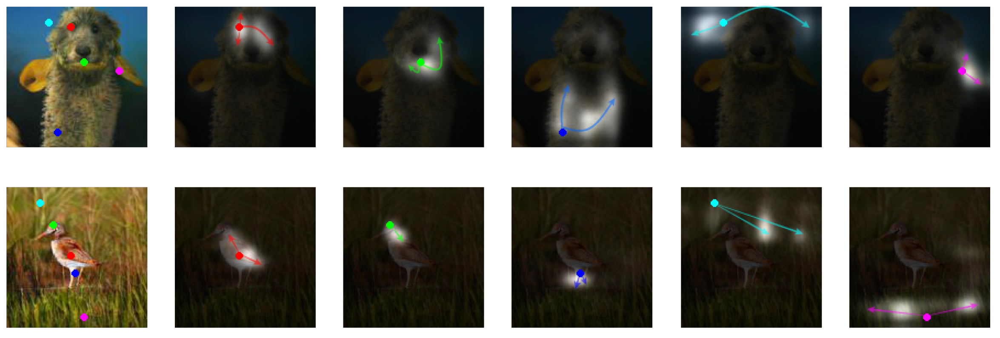

# Self-Attention GAN
Tensorflow implementation for reproducing main results in the paper [Self-Attention Generative Adversarial Networks](https://arxiv.org/abs/1805.08318) by Han Zhang, Ian Goodfellow, Dimitris Metaxas, Augustus Odena.




### Dependencies
python 3.6

TensorFlow 1.5


**Data**

Download Imagenet dataset and preprocess the images into tfrecord files as instructed in [improved gan](https://github.com/openai/improved-gan/blob/master/imagenet/convert_imagenet_to_records.py). Put the tfrecord files into ./data


**Training**

The current batch size is 64x4=256. Larger batch size seems to give better performance. But it might need to find new hyperparameters for G&D learning rate. Note: It usually takes several weeks to train one million steps. 

CUDA_VISIBLE_DEVICES=0,1,2,3 python train_imagenet.py --generator_type test --discriminator_type test --data_dir ./data

**Evaluation**

CUDA_VISIBLE_DEVICES=4 python eval_imagenet.py --generator_type test --data_dir ./data

### Citing Self-attention GAN
If you find Self-attention GAN is useful in your research, please consider citing:

```
@article{Han18,
  author    = {Han Zhang and
               Ian J. Goodfellow and
               Dimitris N. Metaxas and
               Augustus Odena},
  title     = {Self-Attention Generative Adversarial Networks},
  year      = {2018},
  journal = {arXiv:1805.08318},
}
```

**References**

- Spectral Normalization for Generative Adversarial Networks [Paper](https://arxiv.org/abs/1802.05957) 
- cGANs with Projection Discriminator [Paper](https://arxiv.org/abs/1802.05637)
- Non-local Neural Networks [Paper](https://arxiv.org/abs/1711.07971)
